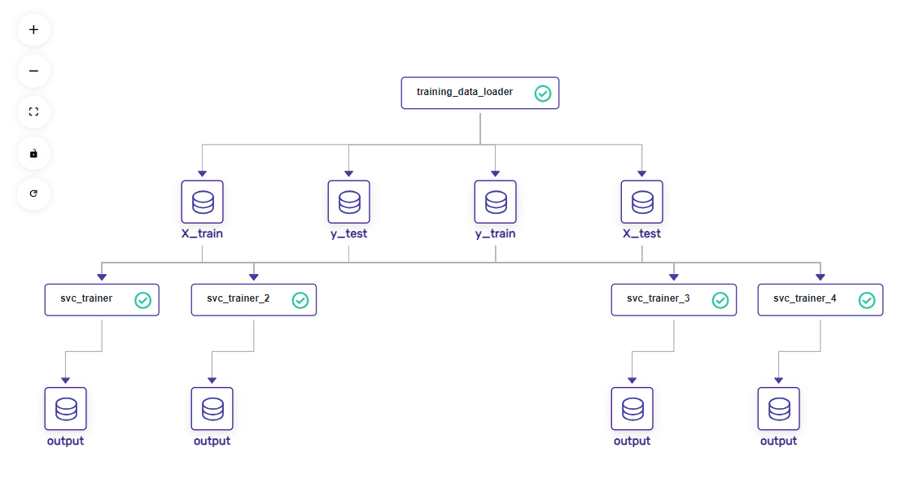

## one time setup
---
```bash
cd %CD%
conda config --add envs_dirs %CD%
conda create --name zenml_test_env_1 --yes python=3.11
conda activate zenml_test_env_1
pip install zenml && pip install "zenml[server]"  && pip install "matplotlib" && zenml integration install sklearn -y && pip install pandas && pip install scikit-learn && pip install zenml && pip install mlflow
conda env list
```


## Run next time
---
```bash
* cd into project directory
* then run >   %CD%\start.bat
* then login into http://127.0.0.1:8237/  as  username : default and no passwored required
```

## stop and clean up
---
```bash
stop zenml server manually ( ctr_c) as its running in blocking mode 
conda deactivate 
zenml clean -y
```

